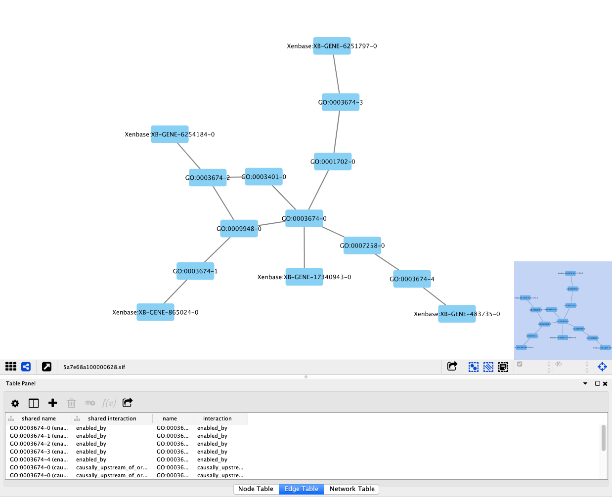

# GOCAM export to SIF
This is a simple tool in NodeJS to convert GO-CAMs from their TTL format to the SIF format. Two SIF archives are currently generated.

## Two SIF Archives

### SIF Gene Product - Gene Product Causal Relationships
In this format, the SIF simplifies the GO-CAMs to only highlight the relationships between Gene Products. As a consequence, GO-CAMs having only 1 Gene Product won't have a SIF as it would consist of a single node.

### SIF GO-CAMs
In this format, the SIF is extended to represent the actual relationships present in the original GO-CAM model.



## Install & Usage

1. Check nodejs is installed, if not, go to [NodeJS](http://www.nodejs.org)
2. Clone this repository and run ```npm install```
3. Then run ```node ttl2sif.js <gocam:ttl:folder> <sif:output:folder>```

Note: 
* should be run on the TTL folder containing production GO-CAMs
* extracting the production GO-CAMs can be done using the following shell command:
```

```
